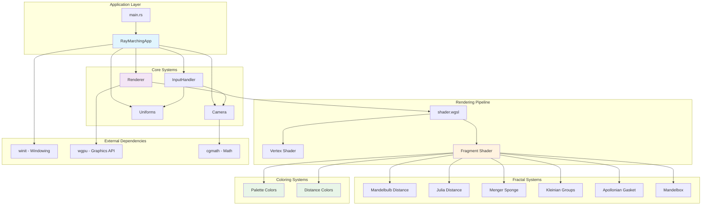

# 3D Fractal Ray Marcher

A high-performance, real-time 3D fractal visualization engine built with Rust and WebGPU. Explore infinite mathematical beauty through interactive ray marching of complex 3D fractals.

## Features

### Multiple Fractal Types
- **Mandelbulb** - Classic 3D fractal with configurable power parameter
- **Julia Sets** - Dynamic 3D Julia fractals with animated parameters  
- **Menger Sponge** - Geometric recursive fractal structure
- **Kleinian Groups** - Complex geometric limit sets
- **Apollonian Gasket** - Circle packing fractals in 3D
- **Mandelbox** - Box-folding fractal variations
- **Auto-cycling** - Fractals automatically transition over time

### Coloring Modes
- **Palette Mode** - Dynamic color palettes with time-based transitions
- **Distance Mode** - Color based on distance from camera (red=close, yellow=medium, blue=far)
- **V key** - Toggle between coloring modes

### Interactive Controls

#### Camera Movement
- **WASD** - Move forward/back/left/right
- **Arrow Keys** - Alternative movement controls
- **Space** - Move up
- **C** - Move down
- **Ctrl + Movement** - Slow mode (precise navigation)
- **Shift + Movement** - Fast mode (3x speed)
- **R** - Reset camera to initial position

#### Mouse Controls
- **Left Click** - Capture mouse for look-around (FPS-style)
- **Mouse Movement** - Look around when captured
- **Right Mouse + Move** - Precise look (30% sensitivity)
- **Mouse Wheel** - Adjust movement speed (0.1x - 20x)
- **Tab** - Toggle mouse capture on/off
- **Escape** - Release mouse and exit

#### Fractal Controls
- **Q/E** - Adjust fractal power (1.0 - 20.0)
- **Z/X** - Change iteration count (8 - 256)
- **1-6** - Select specific fractal type (1=Mandelbulb, 2=Julia, 3=Menger, 4=Kleinian, 5=Apollonian, 6=Mandelbox)
- **0** - Auto-cycle mode (automatic fractal transitions)
- **V** - Toggle coloring mode (Palette/Distance)
- **F** - Display performance statistics

### Visual Effects
- **Advanced Lighting** - Multiple light sources with specular highlights
- **Dynamic Color Palettes** - Beautiful color transitions over time
- **Ambient Occlusion** - Depth-aware shading for realism
- **Fog Effects** - Distance-based atmospheric rendering
- **Real-time Animation** - Fractal parameters evolve continuously

### Performance
- **GPU Acceleration** - WebGPU compute shaders for maximum performance
- **Adaptive Quality** - Configurable iteration limits for performance tuning
- **Optimized Ray Marching** - Efficient distance field calculations
- **Release Mode** - Optimized binary for smooth 60+ FPS
- **Real-time FPS Counter** - Press F to display performance metrics
- **Modular Architecture** - Clean, maintainable code structure

## Requirements

- **Rust** 1.70+ with Cargo
- **GPU** with WebGPU/Vulkan/Metal/DirectX support
- **Display** X11 or Wayland (WSL2 compatible)

## Installation

```bash
git clone https://github.com/cschladetsch/RayMarcher
cd RayMarcher
cargo build --release
```

## Running

### Linux/WSL2
```bash
# For X11 (recommended for WSL2)
WAYLAND_DISPLAY= DISPLAY=:0 ./target/release/RayMarcher

# For Wayland
./target/release/RayMarcher
```

### Windows/macOS
```bash
./target/release/RayMarcher
```

## WSL2 Setup

For WSL2 users, ensure X11 forwarding is configured:

1. Install an X11 server (VcXsrv, X410, or similar)
2. Set display: `export DISPLAY=:0`
3. Run with Wayland disabled: `WAYLAND_DISPLAY= ./target/release/RayMarcher`

## Technical Details

### Architecture



- **Rust** - Memory-safe systems programming
- **wgpu** - Modern WebGPU API for cross-platform GPU access
- **winit** - Cross-platform windowing and input handling
- **cgmath** - Linear algebra for 3D transformations

### Ray Marching Algorithm
The renderer uses sphere tracing (ray marching) to render implicit surfaces defined by distance functions. Each fractal implements a specialized distance estimator:

- **Mandelbulb**: `|z|^n` power iteration in 3D space
- **Julia Sets**: Complex polynomial iteration with animated constants
- **Menger Sponge**: Recursive geometric folding operations

### Shader Pipeline
1. **Vertex Shader** - Generates fullscreen quad
2. **Fragment Shader** - Ray marching and lighting calculations
3. **Distance Fields** - Mathematical fractal definitions
4. **Lighting Model** - Phong shading with multiple lights

## Performance Tips

- Reduce iteration count (Z key) for better performance on slower GPUs
- Lower fractal power (Q key) for simpler calculations
- Run in release mode (`cargo build --release`) for optimal performance

## Development

```bash
# Debug build with logging
RUST_LOG=info cargo run

# Release build
cargo build --release

# Run tests
cargo test
```

## Dependencies

```toml
[dependencies]
winit = "0.30"        # Window management
wgpu = "22"           # WebGPU graphics
cgmath = "0.18"       # Linear algebra
bytemuck = "1.0"      # Memory layout
env_logger = "0.11"   # Logging
pollster = "0.3"      # Async executor
```

## Contributing

1. Fork the repository
2. Create a feature branch (`git checkout -b feature/amazing-fractal`)
3. Commit your changes
4. Push to the branch (`git push origin feature/amazing-fractal`)
5. Open a Pull Request

## Mathematical Background

### Mandelbulb Distance Estimation
```glsl
float mandelbulb_distance(vec3 pos) {
    vec3 z = pos;
    float dr = 1.0;
    float power = 8.0;
    
    for(int i = 0; i < iterations; i++) {
        float r = length(z);
        if(r > 4.0) break;
        
        float theta = acos(z.z / r);
        float phi = atan(z.y, z.x);
        dr = pow(r, power - 1.0) * power * dr + 1.0;
        
        float zr = pow(r, power);
        z = zr * vec3(
            sin(theta * power) * cos(phi * power),
            sin(theta * power) * sin(phi * power),
            cos(theta * power)
        ) + pos;
    }
    
    return 0.5 * log(r) * r / dr;
}
```

## License

This project is licensed under the MIT License - see the [LICENSE](LICENSE) file for details.

## Acknowledgments

- [Íñigo Quílez](https://www.iquilezles.org/) - Ray marching and distance field techniques
- [Daniel White](https://www.skytopia.com/project/fractal/mandelbulb.html) - Mandelbulb discovery
- [wgpu-rs](https://github.com/gfx-rs/wgpu) - Excellent WebGPU implementation

## Controls Summary

### Quick Start
1. Run the application: `WAYLAND_DISPLAY= DISPLAY=:0 ./target/release/RayMarcher`
2. **Left click** to capture mouse and start exploring
3. Use **WASD** to move through the fractal
4. Try number keys **1-6** to switch between different fractals
5. Press **F** to see performance statistics
6. Press **Escape** to exit

### Complete Control Reference

#### Navigation
- **Left Click** - Capture mouse for FPS-style look
- **WASD** - Move forward/back/left/right  
- **Arrow Keys** - Alternative movement
- **Space** - Move up
- **C** - Move down
- **Mouse** - Look around (when captured)
- **Right Mouse + Move** - Precise look (30% sensitivity)
- **Mouse Wheel** - Adjust movement speed (0.1x - 20x)
- **Tab** - Toggle mouse capture on/off
- **R** - Reset camera to starting position

#### Speed Modifiers
- **Ctrl + Movement** - Slow/precise mode (10% speed)
- **Shift + Movement** - Fast mode (3x speed, except vertical)

#### Fractal Selection
- **1** - Mandelbulb (default, classic 3D fractal)
- **2** - Julia Sets (animated complex fractals)
- **3** - Menger Sponge (geometric recursive structure)
- **4** - Kleinian Groups (complex geometric limit sets)
- **5** - Apollonian Gasket (3D circle packing)
- **6** - Mandelbox (box-folding fractal variations)
- **0** - Auto-cycle mode (automatic transitions)

#### Fractal Parameters
- **Q/E** - Decrease/increase fractal power (1.0 - 20.0)
- **Z/X** - Decrease/increase iteration count (8 - 256)
- **V** - Toggle coloring mode (Palette/Distance)

#### System
- **F** - Display performance statistics (FPS, frame time, settings)
- **Escape** - Exit application

## Performance Tips

- Start with **Mandelbulb (key 1)** for best performance
- Use **Z key** to reduce iterations for better FPS on slower GPUs
- **Ctrl + movement** for precise navigation in complex areas
- **Mouse wheel** to find comfortable movement speed
- Press **F** to monitor performance in real-time

## Screenshots

*Beautiful 3D fractals await! Run the application to see them in motion.*

---

**Built with Rust**
